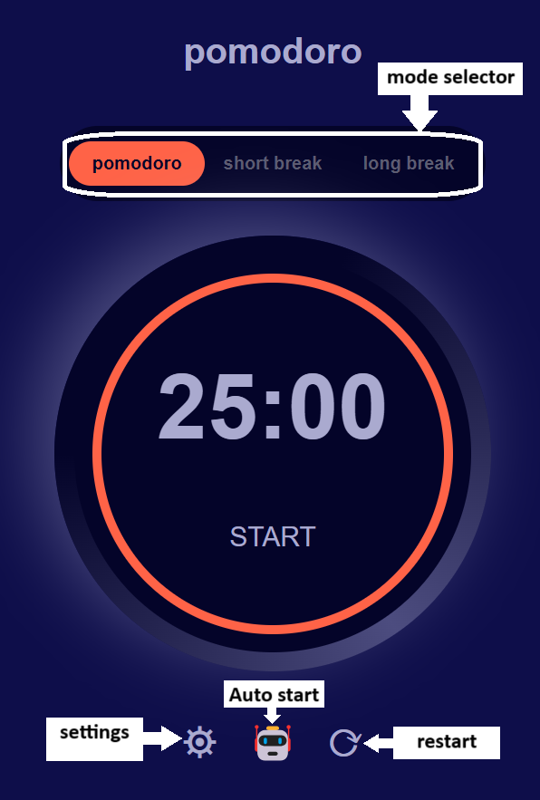

# Pomodoro timer app
 Yay it's a timer app 🥳

This is a simple timer app built with html, css and javascript. The design for this is sourced from [frontend-mentor-challenges](https://www.frontendmentor.io/challenges).

Here are some of the previews for the app :-

---

## Home Screen

This is the home screen for this app. In here the user can choose the timer he wants to run. The user can also access settings, auto run timer or restart timer. The auto run plays the timer in this sequence pomodoro => short break => pomodoro => short break => pomodoro => long break.

| **Button** | **Function** |
|---|---|
|pomodoro| set timer mode to pomodoro|
|short break| set timer mode to short break|
|long break| set timer mode to long break|
|settings icon| opens the settings modal |
|robot icon| auto starts the timer|
|reset icon| resets the timer to initial state|

---

## Settings modal

This is the settings modal for the app. In here user can input positive number duration for each mode of timer in minutes , select font type from sans-serif , serif and monospace and select color from pink , tomato and aqua.

| **Interactive elements** | **Function** |
|---|---|
|cross icon button| closes settings modal|
|pomodoro labelled input field| lets user input pomodoro timer duration|
|short break labelled input field| lets user input short break timer duration|
|long break labelled input field| lets user input long break timer duration|
|sans-serif labelled radio button| lets user select sans-serif font type|
|serif labelled radio button| lets user select serif font type|
|monospace labelled radio button| lets user select monospace font type|
|tomato labelled radio button| lets user select tomato color type|
|pink labelled radio button| lets user select pink color type|
|aqua labelled radio button| lets user select aqua color type|
|apply button| lets user apply changes|

---

## FrontEndMentor

This project is tagged as advanced in Frontend Mentor and is intended for premium users, so I couldn't see the complete challenge. However, I decided to make it with the tools I had. I did this project to test my knowledge, and my problem-solving approach in the technologies I practice.

---

## Coding Map

1. I started with cloning the designs with html and css from the [frontend-mentor-challenges](https://www.frontendmentor.io/challenges) .
2. The challenge I faced was creating the dial . This was achieved by the pseudo elements. 
3. After that I started working on the javascript code for the project . Whole app is supported by a single js file which includes all the button functionalities and the computer scripts baked into them.
4. Another challenge I faced was to develop code to achieve the sequence in which timer runs alternating between pomodoro and short break a few times and at end run long break. 
5. My first approach was to use promise but that didn't work then recursive function calling was used which totally worked.
6. After this I worked on responsiveness of the app.

## Deployment 

After completing the project I created a gitHub repo added my codebase and deployed the website using gitHub pages you access it from 
<!-- [Website Link](https://corack01.github.io/Tic-Tac-Toe-Game/).  -->

---

